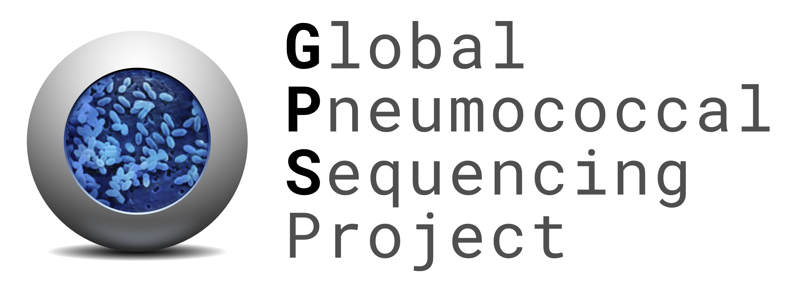

    <picture>
        <source srcset="images/GPS_logo_dark.png" media="(prefers-color-scheme: dark)">
        
    </picture>

## Welcome to the Global Pneumococcal Sequencing Project!
The Global Pneumococcal Sequencing (GPS) Project aims to strengthen worldwide genomic surveillance of *Streptococcus pneumoniae* through a decentralised data generation and analysis network to provide evidence for pneumococcal disease control. This GitHub organisation hosts open source tools, databases, and tutorials created under the GPS project. 